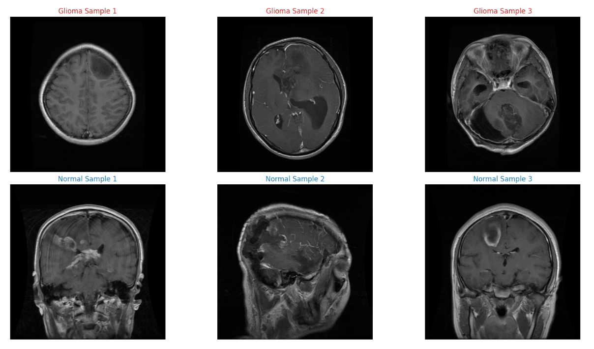
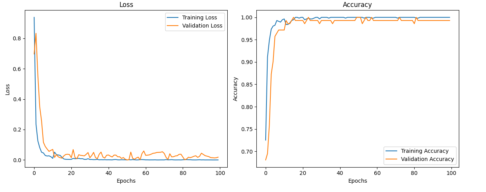

# Brain Tumor MRI Classification

A deep learning project for classifying brain MRI scans to detect glioma tumors.

## Table of Contents
- [Overview](#overview)
- [Dataset](#dataset)
- [Results](#results)
- [SHAP Analysis](#shap-analysis)
- [Installation](#installation)
- [Usage](#usage)
- [License](#license)

## Overview
This project implements a Convolutional Neural Network (CNN) in PyTorch to classify brain MRI scans as either containing glioma tumors or being tumor-free. The model is trained on grayscale MRI images and uses SHAP (SHapley Additive exPlanations) for model interpretability.

## Dataset
The dataset used is the [Brain Tumor MRI Dataset](https://www.kaggle.com/datasets/masoudnickparvar/brain-tumor-mri-dataset) from Kaggle, containing:
- 926 glioma tumor images
- 937 no-tumor images
## Results
The model achieved Accuracy of 99.29%.

## Model Architecture
The model consists of three convolutional blocks followed by fully connected layers.

